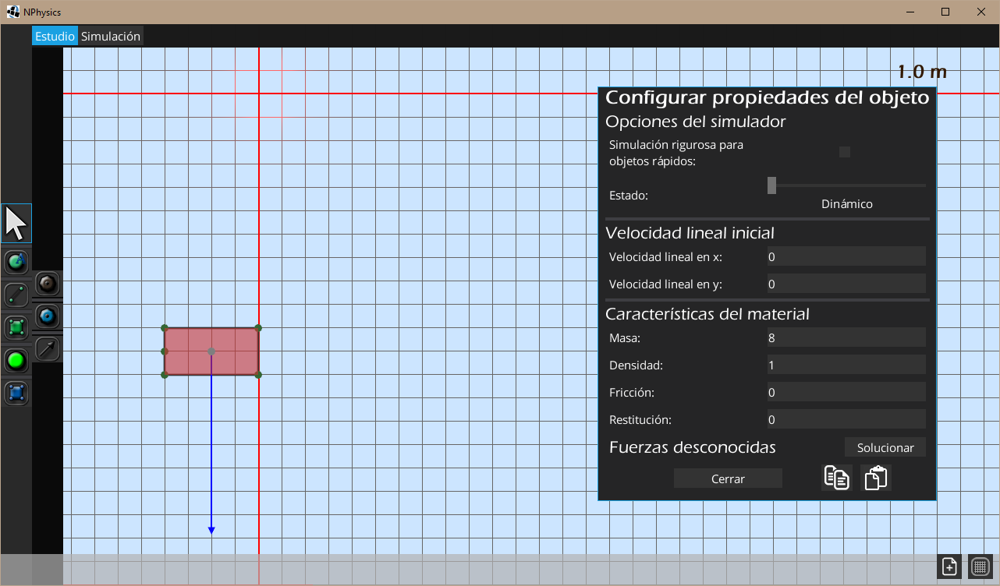
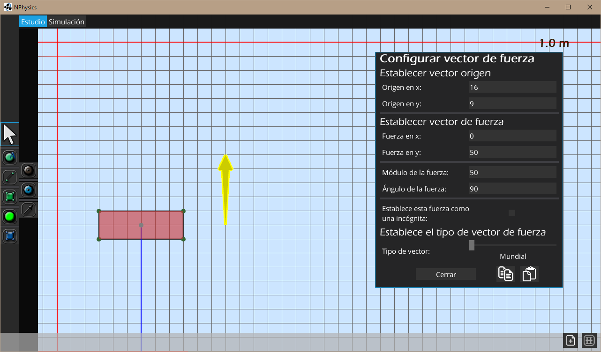

<link href="https://fonts.googleapis.com/css?family=Source+Sans+Pro" rel="stylesheet" type="text/css">
<style>
.inner {width: 1200px;} 
body {
    font-family: 'Source Sans Pro', sans-serif;
    font-size: 20px;
    font-weight: 400;
    line-height: 1.6;
    color: #666;
    letter-spacing: 1.5px;
}

.imgscreen{

    width: 100%
}
#main-content {width: 80%;}
</style>
# ¿Qué es NPhysics?

Este es un trabajo de investigación de bachillerato, el propósito de este es la creación de un Simulador de Dinámica que permita resolver problemas de estática planteados por el usuario, un conjunto de problemas físicos y mecánicos donde el objetivo que se busca es encontrar el equilibrio de las fuerzas en el sistema. Una vez este solucione el sistema ejecutará una simulación en tiempo real donde se supondrá que es una situación dinámica y se comprobará si realmente hay movimiento. Tanto la simulación como el planteamiento del problema se llevarán a cabo en un entorno gráfico y de fácil uso.

# Simulaciones de ejemplo
## Ejemplo de un brazo robótico  
<iframe width="100%" height="500" id="1" src="https://www.youtube.com/embed/Fn4RER__GAM" frameborder="0" allow="accelerometer; autoplay; encrypted-media; gyroscope; picture-in-picture" allowfullscreen></iframe>

## Cálculo del par motor
<iframe width="100%" height="500" id="2" src="https://www.youtube.com/embed/QfJBSMPoN-0" frameborder="0" allow="accelerometer; autoplay; encrypted-media; gyroscope; picture-in-picture" allowfullscreen></iframe>

## Simulación con agua
<iframe width="100%" height="500" id="3" src="https://www.youtube.com/embed/cf9TsXBXMsg" frameborder="0" allow="accelerometer; autoplay; encrypted-media; gyroscope; picture-in-picture" allowfullscreen></iframe>

# Aplicaciones

El programa que he desarrollado permite de una forma eficiente resolver problemas que podrían necesitar de ensayos reales de los que la mayoría seguramente serían destructivos. Tampoco sería justo ni sensato proponer ningún programa informático como sustituto del ensayo empírico de una estructura pero sí permiten muchísima flexibilidad a esta alternativa, se pueden simular gran variedad de estructuras en cuestiones de segundos sin falta de ningún gasto económico o material.
Por otro lado, también creé el programa con el propósito de que todo el mundo que estuviese interesado en el mundo de la mecánica lo pudiera utilizar y sobre todo poder despertar el interés por la mecánica, la física, y la ciencia en general a un público general.

# Instalación

NPhysics es un programa portable, no es necesaria ninguna interfaz de instalación y se puede ejecutar desde la carpeta contenedora del programa. Se puede o bien descargar la última versión estable ya compilada desde GitHub o compilar el proyecto por uno mismo.

## Descargar

El programa se puede descargar desde la página de GitHub en su última versión estable ya compilada, en cada lanzamiento existen 3 versiones del programa comprimido:

+ *NPhysics.zip* (Para descomprimir usando cualquier programa de descompresión)
+ *NPhysics.7z* (Para descomprimir usando 7z)
+ *NPhysics.exe* (Autoejecutable para Windows que descomprime el programa)

NPhysics esta escrito en Java lo que permite que el programa sea multiplataforma, se puede ejecutar en cualquier distribución de Linux, Windows y MacOS. Siempre y cuando se tenga instalado [JRE](https://www.oracle.com/technetwork/java/javase/downloads/jre8-downloads-2133155.html) o [JDK](https://www.oracle.com/technetwork/java/javase/downloads/jdk8-downloads-2133151.html)  

Una vez descargado y descomprimido solo hay que ejecutar el archivo *NPhysics.jar*, por defecto el programa se ejecuta en pantalla pero se puede ejecutar en modo ventana con el archivo *window.bat* (solo en Windows).

También se puede ejecutar desde un terminal escribiendo la orden ```java -jar NPhysics.jar```, en pantalla completa, y ```java -jar NPhysics.jar window```, en modo ventana. 
## Para compilar

En caso que se desee usar la última versión del programa en su último commit se puede compilar el programa directamente desde el repositorio.
El proyecto es gestionado usando gradle. Para compilar los archivos binarios solo hay que ejecutar la siguiente orden en la raíz del repositorio:  

```gradlew desktop:dist```  

Esta ordena compilará el programa y copiara el ejecutable en la carpeta ```desktop/build/libs```, esta es la carpeta en la que se generará el programa compilado cada vez.  
Una vez compilado hay que copiar todo el contenido de la carpeta ```desktop/assets``` a la carpeta donde se encuentra el compilado.  

### Para ejecutar

Para ejecutar el programa ya compilado solo hay que ejecutar la orden ```java -jar desktop1.0```  
Usa las siguientes bibliotecas:  
[Libgdx](https://libgdx.badlogicgames.com/)  
[Earcut4j](https://github.com/earcut4j/earcut4j)  
[JTS](https://github.com/locationtech/jts)  

# Guía de uso  

Este apartado pretende servir como una pequeña guía de uso introductoria para mostrar las funciones del programa, desde poder crear objetos simples hasta poder incluir en la simulación muelles, poleas, ejes, motores, agua y más. Para hacer esta guía más explicatória y amena irá acompañada de una serie de videos por cada apartado en los que se mostrará los pasos a seguir.  

## Primeros pasos

Este apartado tiene como objetivo mostrar la creación de objetos simples, poder modificar sus atributos físicos y mostrar el manejo de los objetos y de las entidades básicas de la fase de diseño de la simulación.

El programa por defecto usará el inglés como lengua, si se desea cambiar de lengua pulse  ```F1``` para mostrar la configuración del programa, modifique el valor ```Language``` usando la barra desplazable y modifique su opción. Una vez hecho los cambios hay que reiniciar el programa para que surtan efecto.  


Una vez configurado el idioma el programa esta listo para su uso, a partir de aquí ya no es necesario configurar nada más para usar el programa aunque le recomiendo leer y seguir la guía.  

<iframe width="100%" height="500" if="4" src="https://www.youtube.com/embed/9XXuS8zimsY" frameborder="0" allow="accelerometer; autoplay; encrypted-media; gyroscope; picture-in-picture" allowfullscreen></iframe>

### Disposición de los elementos gráficos  

Una vez abierto el programa, este muestra una cuadrícula sobre un fondo azul claro, esta es la area de diseño, donde definiremos los objetos i las relaciones entre ellos. El programa tiene 3 menús principales: 

+ La barra superior que nos permite cambiar entre la fase de diseño y la de simulación
+ El menú lateral que nos permite seleccionar la herramienta a usar en la fase de diseño
+ La barra inferior que contiene un botón para borrar todos los objetos del diseño y otro para poder activar/desactivar la función del programa que autoajusta los elementos a la cuadrícula. 

Al pasar el cursor por encima de uno de los botones del menú lateral de las herramientas este mostrará en pantalla un breve texto que describe su función.  

### Movimiento del plano

Por defecto la herramienta seleccionada es la del **mouse** , esta nos permite seleccionar objetos y mover el plano. Si pulsamos en un lugar vacío y mantenemos pulsado podremos arrastrar el plano, también podemos mover el eje de referencia pulsando la tecla ```A``` sobre el lugar deseado.

### Crear un objeto simple

Para crear un objeto o cuerpo simple con forma de polígono hay que pulsar usar la **herramienta de creación de polígono** . Para crear un polígono solo hay que clicar en el plano los puntos deseados que conformaran sus vértices, una vez terminado hay que volver a clicar sobre el primer vértice.

No hay que preocuparse por crear los puntos por separado si la posición deseada no es un punto el programa lo creara automáticamente.

Una vez el objeto esta creado se puede acceder a la ventana para cambiar sus propiedades físicas con la tecla ```Q```. En esta se muestran varias opciones listadas a continuación:



+ Opciones del simulador
    - Simulación rigurosa para objetos rápidos (Como de rigurosa debe ser la simulación en casos extremos, dejar desmarcada por norma general)
    - Estado (Dinámico, Kinemático, Estático)
+ Velocidad lineal (en m/s)
    - Velocidad lineal en x 
    - Velocidad lineal en y 
+ Características del material
    - Masa (en kg)
    - Densidad (en kg/m^2)
    - Fricción (Coeficiente de fricción, entre 0 y 1)
    - Restitución (Coeficiente de restitución, entre 0 y 1)

La opción de simulación rigurosa para objetos rápidos solo se debe aplicar a aquellos objetos que experimenten comportamientos extraños como atravesar otros objetos. Esta opción le marcará al simulador que sea más riguroso en el momento de calcular las colisiones.

La velocidad lineal es la velocidad inicial del objeto.

Después de cambiar cualquier valor se recomienda pulsar ```Intro``` para que los cambios surtan efecto.

Con el objeto seleccionado se puede pulsar la tecla ```C``` sobre cualquier punto para crear un duplicado del objeto.  

### Simulación

Una vez dispuestos los objetos se puede pasar a la fase de Simulación con pulsar su botón en la barra superior. El fondo cambia a un color negro y la simulación empieza. En esta fase se puede coger objetos con el ratón y manipularlos. El programa muestra las fuerzas que actúan sobre los objetos (excepto las producidas por colisiones).

| Tipo de Fuerza | Color |
|---|---|
| Fuerzas descritas por el usuario | Rojo |
| Fuerza de gravedad | Amarillo |
| Fuerzas de reacción  | Verde |
| Tensión de las cuerdas | Naranja |  

También puede mostrar el momento lineal de los objetos pulsando la tecla ```I```, por defecto esta función esta desactivada. Cuando se simulan muchos objetos a la vez puede parecer muy caótico que el programa muestre toda esta información, por eso existe una función que permite esconder todas las flechas, valores y oscurecer los objetos, y solo mostrar resaltada la información del objeto seleccionado. Esta función se activa con la tecla ```U```.

Para volver a la fase de diseño solo hay que pulsar su botón en la barra superior.

---  
## Definir Fuerzas

Una vez definido el objeto en la fase de edición se le puede añadir fuerzas que se aplicarán en la simulación. Para crear una fuerza primero hay que seleccionar el objeto en el modo de diseño. Luego usar la **herramienta de creación de fuerzas** .  

Para crear la fuerza hay que clicar en el punto del plano que sera su origen, luego en el punto en que el vector de la fuerza termina, esto es solo para poder definir la dirección del vector de una forma visual, para poder definir la magnitud del vector de una forma más precisa se selecciona el vector y este mostrará en pantalla la ventana para poder editar sus propiedades. El vector seleccionado se pinta de Amarillo. 



+ Establecer vector origen
    Permite establecer las coordenadas del origen del vector con respecto al eje de referencia
+ Establecer vector de fuerza
    Permite establecer las componentes del vector, su módulo y su ángulo, en el caso de que se quiera trabajar con coordenadas cartesianas o polares
    - *Establecer esta fuerza como una incógnita*
        Establece este vector como una incógnita, más adelante se explica esta función.
+ Tipo de vector
    Esta opción permite definir como debe evolucionar la posición del vector conforme se ejecute la simulación:
    + *Mundial* hace que el vector siempre se aplique en la misma posición mundial (no relativa al objeto).
    + *Relativa en traslación* hace que el origen del vector sea relativo a la posición y ángulo del objeto pero su dirección será siempre la misma.
    + *Relativa* hace que el origen y la dirección del vector sean relativos a la posición y rotación del objeto.

Una vez modificados los parámetros deseados cierre la ventana con ```Cerrar``` y podrá ver actuar la fuerza en la fase de simulación.
Para poder eliminar una fuerza hay que seleccionarla y pulsar ```Suprimir```.


## Articulaciones

El programa permite crear varios tipos de articulaciones para poder simular escenarios mas complejos. Esta es una lista de todas las articulaciones o herramientas para definir relaciones entre dos objetos del simulador.

+ Ejes y motores
+ Vías prismáticas
+ Cuerdas
+ Muelles
+ Poleas

<iframe width="100%" height="500" if="5" src="https://www.youtube.com/embed/fGHbkg4_ygM" frameborder="0" allow="accelerometer; autoplay; encrypted-media; gyroscope; picture-in-picture" allowfullscreen></iframe>
