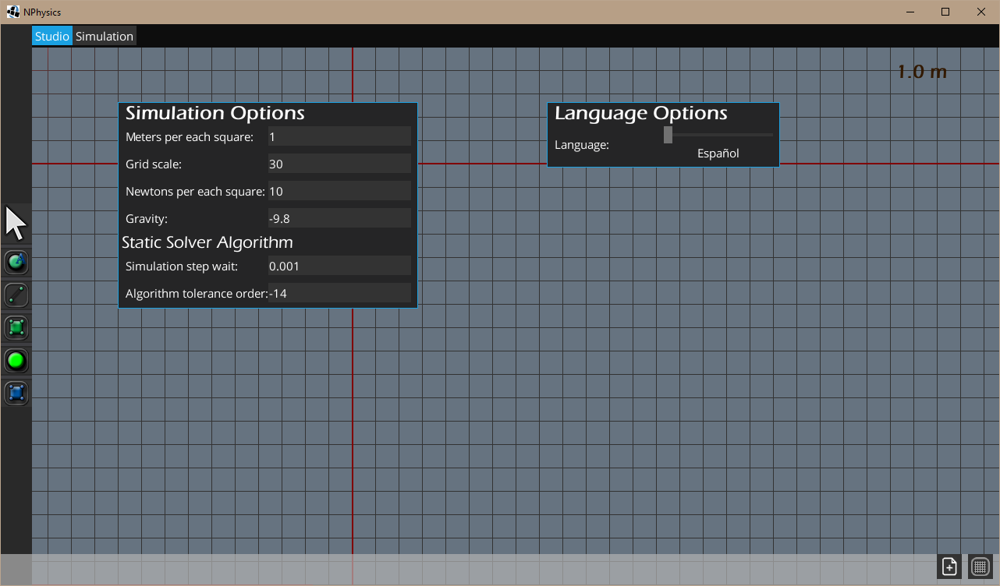

<link href="https://fonts.googleapis.com/css?family=Source+Sans+Pro" rel="stylesheet" type="text/css">
<style>
.inner {width: 60%;} 
body {
    font-family: 'Source Sans Pro', sans-serif;
    font-size: 20px;
    font-weight: 400;
    line-height: 1.6;
    color: #666;
    letter-spacing: 1.5px;
}

img{

    width: 100%
}
#main-content {width: 80%;}
</style>
## Welcome to GitHub Pages

Este es un trabajo de investigación de bachillerato, el propósito de este es la creación de un Simulador de Dinámica que permita resolver problemas de estática planteados por el usuario, un conjunto de problemas físicos y mecánicos donde el objetivo que se busca es encontrar el equilibrio de las fuerzas en el sistema. Una vez este solucione el sistema ejecutará una simulación en tiempo real donde se supondrá que es una situación dinámica y se comprobará si realmente hay movimiento. Tanto la simulación como el planteamiento del problema se llevarán a cabo en un entorno gráfico y de fácil uso.

### Ejemplo de un brazo robótico  
<iframe width="100%" height="500" src="https://www.youtube.com/embed/Fn4RER__GAM" frameborder="0" allow="accelerometer; autoplay; encrypted-media; gyroscope; picture-in-picture" allowfullscreen></iframe>

## Descargar

El programa se puede descargar desde la página de GitHub en su última versión estable ya compilada, en cada lanzamiento existen 3 versiones del programa comprimido:

+ NPhysics.zip (Para descomprimir usando cualquier programa de descompresión)
+ NPhysics.7z (Para descomprimir usando 7z)
+ NPhysics.exe (Autoejecutable para Windows que descomprime el programa)

NPhysics esta escrito en Java lo que permite que el programa sea multiplataforma, se puede ejecutar en cualquier distribución de Linux, Windows y MacOS. Siempre y cuando se tenga instalado [JRE](https://www.oracle.com/technetwork/java/javase/downloads/jre8-downloads-2133155.html) o [JDK](https://www.oracle.com/technetwork/java/javase/downloads/jdk8-downloads-2133151.html)  
## Para compilar

En caso que se desee usar la última versión del programa en su último commit se puede compilar el programa directamente desde el repositorio.
El proyecto es gestionado usando gradle. Para compilar los archivos binarios solo hay que ejecutar la siguiente orden en la raíz del repositorio:  

```gradlew desktop:dist```  

Esta ordena compilará el programa y copiara el ejecutable en la carpeta ```desktop/build/libs```, esta es la carpeta en la que se generará el programa compilado cada vez.  
Una vez compilado hay que copiar todo el contenido de la carpeta ```desktop/assets``` a la carpeta donde se encuentra el compilado.  

### Para ejecutar

Para ejecutar el programa ya compilado solo hay que ejecutar la orden ```java -jar desktop1.0```  
Usa las siguientes bibliotecas:  
[Libgdx](https://libgdx.badlogicgames.com/)  
[Earcut4j](https://github.com/earcut4j/earcut4j)  
[JTS](https://github.com/locationtech/jts)  

# Guía de uso  

Este apartado pretende servir como una pequeña guía de uso introductoria para mostrar las funciones del programa, desde poder crear objetos simples hasta poder incluir en la simulación muelles, poleas, ejes, motores, agua y más. Para hacer esta guía más explicatoria y amena irá acompañada de una série de videos por cada apartado en los que se mostrará los pasos a seguir.  

## Primeros pasos

Este apartado tiene como objetivo mostrar la creación de objetos simples, poder mnodificar sus atributos físicos y mostrar el manejo de los objetos y de las entidades básicas de la fase de diseño de la simulación.

<iframe width="100%" height="500" src="https://www.youtube.com/embed/9XXuS8zimsY" frameborder="0" allow="accelerometer; autoplay; encrypted-media; gyroscope; picture-in-picture" allowfullscreen></iframe>

Una vez abierto el programa, este muestra una cuadrícula sobre un fondo azul claro, esta es la area de diseño, donde definiremos los objetos i las relaciones entre ellos.  

El programa por defecto usará el inglés como lengua, si se desea cambiar de lengua solo hay que pulsar F1 y modificar su opción. Una vez hecho los cambios hay que reiniciar el programa para que surtan efecto.
